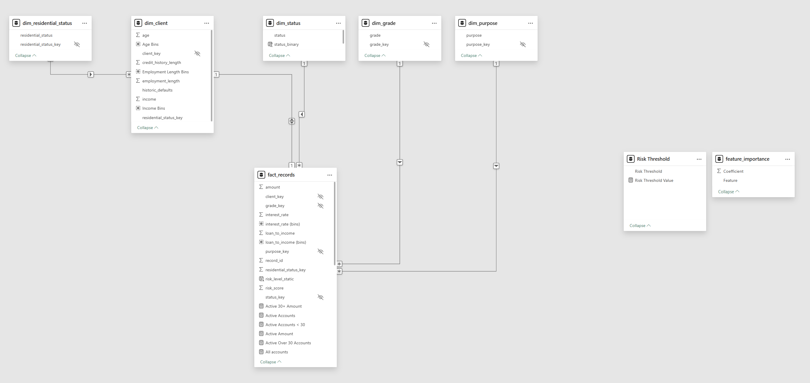

# Credit Risk And Loss Insights For Young Borrowers ( Under 30 )
A business intelligence case study using Power BI and data analytics

 dashboard")

## Table of Contents
- [Project Introduction](#project-introduction)
- [Dataset Information](#dataset-information)
- [Key Insights From Data](#key-insights-from-data)
- [Business Recommendation](#business-recommendation)

## Project Introduction
Credit risk team is facing a problem an increase in loan defaults among younger applicants and those with limited employment history. There is a need for a tool to be able to differentiate between high-risk and low-risk borrowers within key customer segments.The goal is to make smarter, data-driven decisions about who to lend to, under what terms, and with what level of risk. 

By building a **Power BI dashboard** using credit reference data, the analytics team can uncover patterns in age, income, employment length, and historical defaults—helping stakeholders visualize risk across borrower profiles and loan types. 

This project aims to reduce default rates, improve customer targeting, and align lending practices with strategic goals. **This project is created with synthetic data and a fictional story**

## Dataset Information
This dataset simulates credit reference agency data and was sourced from [Kaggle](https://www.kaggle.com/datasets/laotse/credit-risk-dataset/data) for the purposes of this project. It contains anonymized records of loans, including key variables such as applicant age, income, employment length, home ownership status, loan intent, loan grade, interest rate, and historical default indicators.

### Dataset Structure
| Feature Name                 | Description                          |
|-----------------------------|--------------------------------------|
| person_age                  | Age                                  |
| person_income               | Annual Income                        |
| person_home_ownership       | Home ownership                       |
| person_emp_length           | Employment length (in years)         |
| loan_intent                 | Loan intent                          |
| loan_grade                  | Loan grade                           |
| loan_amnt                   | Loan amount                          |
| loan_int_rate               | Interest rate                        |
| loan_status                 | Loan status (0 = non-default, 1 = default) |
| loan_percent_income         | Percent income                       |
| cb_person_default_on_file   | Historical default                   |
| cb_preson_cred_hist_length  | Credit history length                |

### Data Model
We are utilising a star schema data model for the purposes of this project. 


## Key Insights From Data
### Which age brackets have the highest number of defaulted accounts?
Identify borrower age groups with elevated default rates to refine targeting and approval criteria.


Based on data we can establish that there is an increased number of defaults for ages between 22 and 24 years old for young people ( people aged below 30 years old ). This indicates that lending to people in this age bracket carries increased risk of default.

### Can employment length act as a risk indicator?
Explore how job stability influences creditworthiness and default behavior.

<!--  --> 

### How does historical default behavior affect current risk?
Evaluate whether borrowers with prior defaults are more likely to default again, informing approval policies and risk scoring models.

<!--  -->


### Can we use loan to income ratio to identify high risk accounts?
Assess whether borrowers with higher loan-to-income ratios are more likely to default, guiding affordability thresholds.

<!--  -->


### Which loan intents are most associated with default?
Analyze default rates across loan purposes (e.g., education, medical, home improvement) to identify high-risk categories and adjust product offerings.

<!--  -->

### Do high interest rates affect default rates?
Investigate whether borrowers with higher interest rates are more likely to default, helping assess the risk-return balance and inform pricing strategies.

<!--  -->

### What is the business impact?
Quantify the business cost of defaults across high-risk demographics to support strategic lending decisions.

<!--  -->

<!--  -->


### Predictive modeling
In order to clasify records by risk level a regression model was implemented within power bi using python using key features like interest_rate, loan_to_income, purpose, residential_status, age, employment_length, historic_defaults_binary (binary value to indicate whether records had historic default. 0 no historic default, 1 having historic defaults). Based on this model achieved AUC score of 0.8 indicating a strong ability to distinguish between default and non default cases. 


#### Python regression risk modeling code.
```python
# 'dataset' holds the input data for this script
import pandas as pd
from sklearn.linear_model import LogisticRegression
from sklearn.metrics import accuracy_score, precision_score, recall_score, roc_auc_score

# Prepare data
df = dataset.copy()

# Select predictors including correlated features
X = df[['interest_rate', 'loan_to_income', 'purpose', 'residential_status',
        'age', 'employment_length', 'historic_defaults_binary']]
y = df['status_binary']  # Binary target: 0 = no default, 1 = default

# Encode categorical variables
X = pd.get_dummies(X, columns=['purpose', 'residential_status'], drop_first=True)

# Train logistic regression model
model = LogisticRegression(max_iter=1000)
model.fit(X, y)

# Predict risk score (probability of default)
df['risk_score'] = model.predict_proba(X)[:, 1]

# Apply custom threshold to classify predicted defaults
threshold = 0.35 
df['predicted_default'] = (df['risk_score'] > threshold).astype(int)

# Evaluate model performance at this threshold
y_true = df['status_binary']
y_pred = df['predicted_default']

accuracy = accuracy_score(y_true, y_pred)
precision = precision_score(y_true, y_pred)
recall = recall_score(y_true, y_pred)
auc = roc_auc_score(y_true, df['risk_score'])

# Output the dataframe with new columns
dataset = df
```

What if analysis section has been added by way of a slider allowing to adjust threshold levels for classification of records. 

## Business Recommendation
