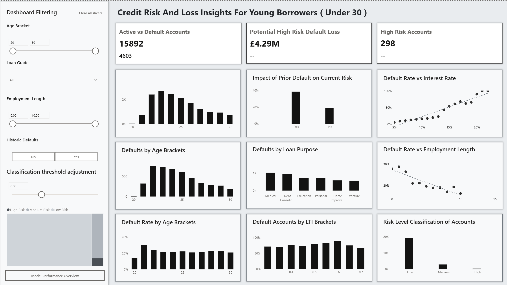
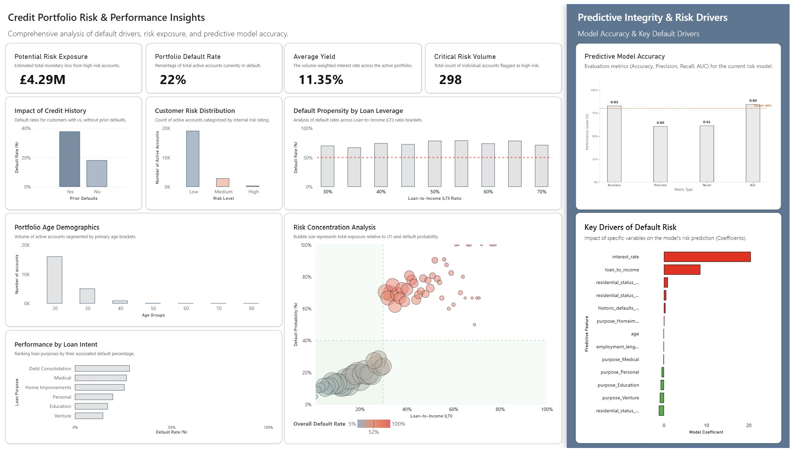

# Credit Portfolio Risk & Performance Insights
A business intelligence case study using Power BI and data analytics



## Table of Contents
- [Executive Summary](#executive-summary)
- [Key Insights From Data](#key-insights-from-data)
- [Dashboard Preview](#dashboard-preview)
- [Dataset Information](#dataset-information)
- [Predictive Modeling](#predictive-modeling)
- [Credits](#credits)

## Executive Summary
Credit risk team is facing a problem an increase in loan defaults among younger applicants and those with limited employment history. There is a need for a tool to be able to differentiate between high-risk and low-risk borrowers within key customer segments.The goal is to make smarter, data-driven decisions about who to lend to, under what terms, and with what level of risk. 

By building a **Power BI dashboard** using credit reference data, the analytics team can uncover patterns in age, income, employment length, and historical defaults—helping stakeholders visualize risk across borrower profiles and loan types. 

This project aims to reduce default rates, improve customer targeting, and align lending practices with strategic goals. **This project is created with synthetic data and a fictional story**

[View Dashboard](https://app.powerbi.com/groups/me/reports/96792b97-c1a8-43fd-9268-c04785202758/00b82ea83aab01ab2ea6?experience=power-bi)

## Key Insights From Data
The current portfolio maintains a 21.66% overall default rate, representing a potential risk exposure of £4.29M across 298 high-risk accounts. Analysis of risk drivers reveals that interest rate is the most significant predictor of default, followed by loan-to-income (LTI) ratios, which show a marked increase in risk propensity once exceeding the 50% threshold. From a segmentation perspective, Debt Consolidation and Medical loans emerge as the highest-risk intents, while borrowers with historic defaults exhibit nearly double the default rate of those with clean credit histories. Although the younger demographic (ages 20–30) represents the highest volume of active accounts, the predictive model maintains a strong 84% AUC, allowing for precise identification of at-risk individuals within this group. To mitigate these exposures, we recommend implementing stricter LTI caps, transitionary manual underwriting for consolidation loans, and proactive intervention strategies for the identified high-risk sub-sector to prevent potential losses from becoming realized capital deficits.

## Dashboard Preview
### Main dashboard overview page


## Dataset Information
We are utilising a star schema data model for the purposes of this project. 


| Feature Name                 | Description                          |
|-----------------------------|--------------------------------------|
| person_age                  | Age                                  |
| person_income               | Annual Income                        |
| person_home_ownership       | Home ownership                       |
| person_emp_length           | Employment length (in years)         |
| loan_intent                 | Loan intent                          |
| loan_grade                  | Loan grade                           |
| loan_amnt                   | Loan amount                          |
| loan_int_rate               | Interest rate                        |
| loan_status                 | Loan status (0 = non-default, 1 = default) |
| loan_percent_income         | Percent income                       |
| cb_person_default_on_file   | Historical default                   |
| cb_preson_cred_hist_length  | Credit history length                |


## Predictive modeling
In order to clasify records by risk level a regression model was implemented within power bi using python using key features like interest_rate, loan_to_income, purpose, residential_status, age, employment_length, historic_defaults_binary (binary value to indicate whether records had historic default. 0 no historic default, 1 having historic defaults). Based on this model achieved AUC score of 0.8 indicating a strong ability to distinguish between default and non default cases. 

#### Python regression risk modeling code.
```python
# 'dataset' holds the input data for this script
import pandas as pd
from sklearn.linear_model import LogisticRegression
from sklearn.metrics import accuracy_score, precision_score, recall_score, roc_auc_score

# Prepare data
df = dataset.copy()

# Select predictors including correlated features
X = df[['interest_rate', 'loan_to_income', 'purpose', 'residential_status',
        'age', 'employment_length', 'historic_defaults_binary']]
y = df['status_binary']  # Binary target: 0 = no default, 1 = default

# Encode categorical variables
X = pd.get_dummies(X, columns=['purpose', 'residential_status'], drop_first=True)

# Train logistic regression model
model = LogisticRegression(max_iter=1000)
model.fit(X, y)

# Predict risk score (probability of default)
df['risk_score'] = model.predict_proba(X)[:, 1]

# Apply custom threshold to classify predicted defaults
threshold = 0.35 
df['predicted_default'] = (df['risk_score'] > threshold).astype(int)

# Evaluate model performance at this threshold
y_true = df['status_binary']
y_pred = df['predicted_default']

accuracy = accuracy_score(y_true, y_pred)
precision = precision_score(y_true, y_pred)
recall = recall_score(y_true, y_pred)
auc = roc_auc_score(y_true, df['risk_score'])

# Output the dataframe with new columns
dataset = df
```

## Credits
This dataset simulates credit reference agency data and was sourced from [Kaggle](https://www.kaggle.com/datasets/laotse/credit-risk-dataset/data) for the purposes of this project. It contains anonymized records of loans, including key variables such as applicant age, income, employment length, home ownership status, loan intent, loan grade, interest rate, and historical default indicators. The dataset is a static snapshot without timeseries data. 
