# Credit Risk And Loss Insights For Young Borrowers ( Under 30 )
A business intelligence case study using Power BI and data analytics

 dashboard")

## Table of Contents
- [Project Introduction](#project-introduction)
- [Dataset Information](#dataset-information)
- [Key Insights From Data](#key-insights-from-data)
- [Business Recommendation](#business-recommendation)

## Project Introduction
Credit risk team is facing a problem an increase in loan defaults among younger applicants and those with limited employment history. There is a need for a tool to be able to differentiate between high-risk and low-risk borrowers within key customer segments.The goal is to make smarter, data-driven decisions about who to lend to, under what terms, and with what level of risk. 

By building a **Power BI dashboard** using credit reference data, the analytics team can uncover patterns in age, income, employment length, and historical defaults—helping stakeholders visualize risk across borrower profiles and loan types. 

This project aims to reduce default rates, improve customer targeting, and align lending practices with strategic goals. **This project is created with synthetic data and a fictional story**

## Dataset Information
This dataset simulates credit reference agency data and was sourced from [Kaggle](https://www.kaggle.com/datasets/laotse/credit-risk-dataset/data) for the purposes of this project. It contains anonymized records of loans, including key variables such as applicant age, income, employment length, home ownership status, loan intent, loan grade, interest rate, and historical default indicators.

### Dataset Structure
| Feature Name                 | Description                          |
|-----------------------------|--------------------------------------|
| person_age                  | Age                                  |
| person_income               | Annual Income                        |
| person_home_ownership       | Home ownership                       |
| person_emp_length           | Employment length (in years)         |
| loan_intent                 | Loan intent                          |
| loan_grade                  | Loan grade                           |
| loan_amnt                   | Loan amount                          |
| loan_int_rate               | Interest rate                        |
| loan_status                 | Loan status (0 = non-default, 1 = default) |
| loan_percent_income         | Percent income                       |
| cb_person_default_on_file   | Historical default                   |
| cb_preson_cred_hist_length  | Credit history length                |

### Data Model
We are utilising a star schema data model for the purposes of this project. 


## Key Insights From Data
### Which age brackets have the highest number of defaulted accounts?
Identify borrower age groups with elevated default rates to refine targeting and approval criteria.

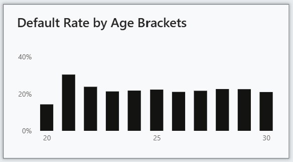

### Can employment length act as a risk indicator?
Explore how job stability influences creditworthiness and default behavior.

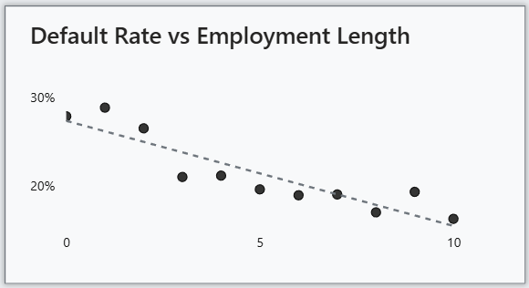 

### How does historical default behavior affect current risk?
Evaluate whether borrowers with prior defaults are more likely to default again, informing approval policies and risk scoring models.

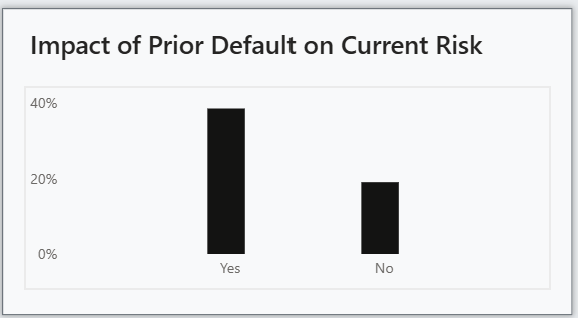


### Can we use loan to income ratio to identify high risk accounts?
Assess whether borrowers with higher loan-to-income ratios are more likely to default, guiding affordability thresholds.

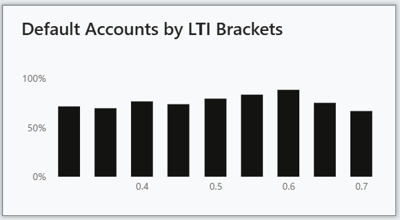


### Which loan intents are most associated with default?
Analyze default rates across loan purposes (e.g., education, medical, home improvement) to identify high-risk categories and adjust product offerings.

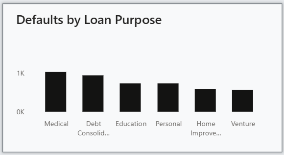

### Do high interest rates affect default rates?
Investigate whether borrowers with higher interest rates are more likely to default, helping assess the risk-return balance and inform pricing strategies.

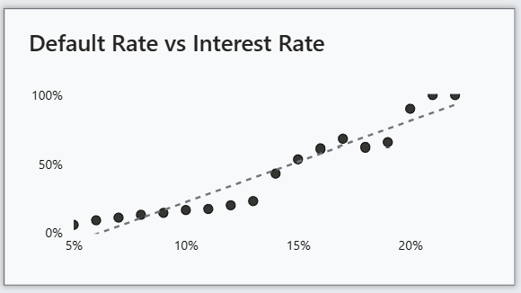

### What is the business impact?
Quantify the business cost of defaults across high-risk demographics to support strategic lending decisions.

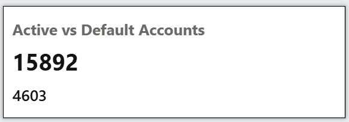

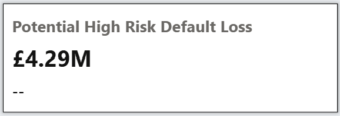

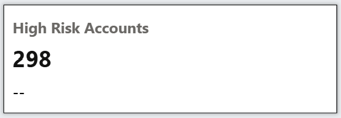


### Predictive modeling
In order to clasify records by risk level a regression model was implemented within power bi using python using key features like interest_rate, loan_to_income, purpose, residential_status, age, employment_length, historic_defaults_binary (binary value to indicate whether records had historic default. 0 no historic default, 1 having historic defaults). Based on this model achieved AUC score of 0.8 indicating a strong ability to distinguish between default and non default cases. 

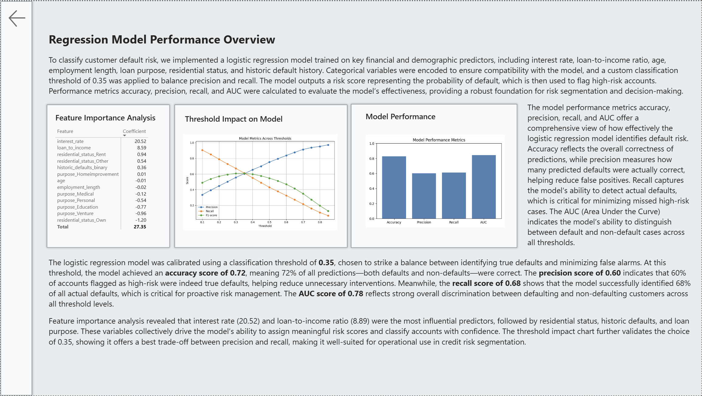

#### Python regression risk modeling code.
```python
# 'dataset' holds the input data for this script
import pandas as pd
from sklearn.linear_model import LogisticRegression
from sklearn.metrics import accuracy_score, precision_score, recall_score, roc_auc_score

# Prepare data
df = dataset.copy()

# Select predictors including correlated features
X = df[['interest_rate', 'loan_to_income', 'purpose', 'residential_status',
        'age', 'employment_length', 'historic_defaults_binary']]
y = df['status_binary']  # Binary target: 0 = no default, 1 = default

# Encode categorical variables
X = pd.get_dummies(X, columns=['purpose', 'residential_status'], drop_first=True)

# Train logistic regression model
model = LogisticRegression(max_iter=1000)
model.fit(X, y)

# Predict risk score (probability of default)
df['risk_score'] = model.predict_proba(X)[:, 1]

# Apply custom threshold to classify predicted defaults
threshold = 0.35 
df['predicted_default'] = (df['risk_score'] > threshold).astype(int)

# Evaluate model performance at this threshold
y_true = df['status_binary']
y_pred = df['predicted_default']

accuracy = accuracy_score(y_true, y_pred)
precision = precision_score(y_true, y_pred)
recall = recall_score(y_true, y_pred)
auc = roc_auc_score(y_true, df['risk_score'])

# Output the dataframe with new columns
dataset = df
```

What if analysis section has been added by way of a slider allowing to adjust threshold levels for classification of records. 

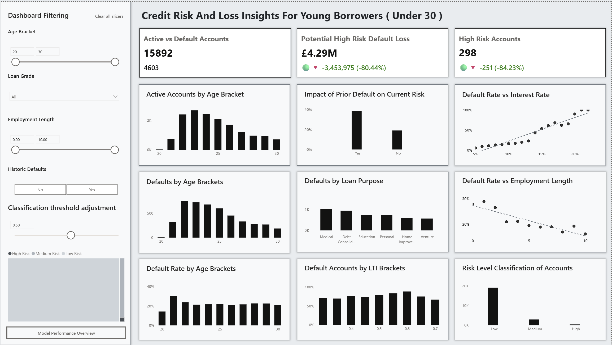


## Business Recommendation

1. Targeted Risk Controls for Young Borrowers
- Borrowers aged 22–24, particularly those aged 21, exhibit the highest default rate at 30.38%, representing a potential loss of £2.55M.
- Recommendation: Implement stricter loan assessments and limit exposure to high-risk loan purposes for this age group. Cap interest rates below 13% to reduce default probability.
- Adopt a proactive engagement strategy: provide financial education, offer incentives, and partner with lifestyle brands to deliver added value (e.g., discounts, freebies). The goal is not to restrict lending, but to prevent defaults through support and tailored products.

2. Enhanced Screening for Applicants with Prior Defaults
- Accounts with historic defaults show default rates exceeding 70%, indicating high vulnerability.
- Recommendation: Apply manual underwriting, require additional documentation, and consider collateral-backed lending. Rather than excluding these borrowers, adopt a mentorship approach—offer short-term interest rate reductions for successful repayments, provide educational resources, and allow flexible repayment options (e.g., payment pauses during hardship). These customers should be approached with care and empathy.

3. Loan Purpose Risk Management
- Medical and Debt Consolidation loans have the highest number of defaults. For applicants with prior defaults, these loan types approach a 100% default rate.
- Recommendation: Enforce stricter eligibility criteria, require guarantors, and apply manual underwriting. Avoid high interest rates—keeping rates below 13% can reduce default risk by approximately 20%.

4. Interest Rate Optimization
- Interest rate is the strongest predictor of default. Accounts with rates above 13% show a 20% increase in default probability.
- Recommendation: Reassess pricing strategies to avoid pushing borrowers into riskier territory. Introduce flexible interest rate products (e.g., fixed vs. variable), and allow borrowers to opt into lower-rate periods to reduce risk and attract new customers.

5. Employment Length as a Risk Signal
- Borrowers with less than 2 years of employment history show elevated default rates.
- Recommendation: Introduce guarantor requirements, secured lending options, or probationary loan tiers. Further data collection on employment type and contract stability is recommended to refine risk scoring.

6. Portfolio-Level Risk Exposure
- The business is currently exposed to a potential loss of £4.29M from 298 high-risk accounts, as identified by the regression model.
- Recommendation: Prioritize these accounts for early intervention, restructuring, or proactive outreach. Offer incentives for good repayment behavior, provide financial education, and allow temporary payment deferrals without penalizing credit scores—especially in cases of life changes or hardship.

7. Loan-to-Income Ratio Monitoring
- While not the strongest predictor, there is a noticeable uptick in defaults for accounts with LTI ratios between 0.5 and 0.6.
- Recommendation: Monitor this bracket closely and consider integrating LTI thresholds into the risk scoring framework to improve affordability checks.

